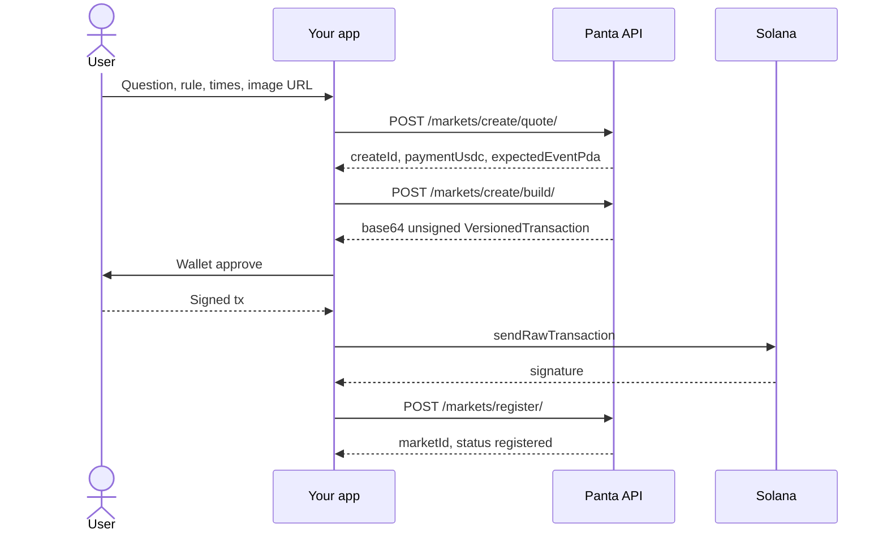

> ## Documentation Index
> Fetch the complete documentation index at: https://docs.panta.market/llms.txt
> Use this file to discover all available pages before exploring further.

# How it works

> Quote, build an unsigned transaction, sign in the wallet, broadcast on your RPC, then confirm with Panta.

Panta never holds private keys. Every write that touches Solana is a **session**:

1. **Quote** — validate inputs, lock a short-lived intent, return price.
2. **Build** — return an unsigned `VersionedTransaction` or instruction list plus a recent blockhash.
3. **Sign + broadcast** — your app asks the user’s wallet to sign, then you send the tx on **your** RPC.
4. **Confirm** — send Panta the signature so we can verify on-chain and update catalog / attribution.

## Create market

Sessions (`createId`) last about **5 minutes**. Rebuild if the blockhash expires (\~60s). Do not edit accounts or fee amounts; register checks the chain against the quote.

Creating a market requires a public catalog `imageUrl` (recommended **1024×1024** square). Soft-validated URL rules — see [Quote a market](/api-reference/markets/quote). Optional helper: [image upload](/api-reference/markets/image-upload). Optional fields include `region`, `oracle`, and (for breaking markets) `eventInProgress`.

`startTime` must respect on-chain `minimumStartDelay` (typically **3600s** ahead of now) unless `eventInProgress` is set on a breaking market.

## Primary buy

Same pattern, different ids:

| Step            | Id                                    |
| --------------- | ------------------------------------- |
| Quote           | `quoteId` (\~90s)                     |
| Build           | `orderId` (\~120s)                    |
| After broadcast | submit and/or verify with `signature` |

Primary buy **build** returns **instructions** (not a fully assembled tx). Compile a versioned transaction from `instructions` + `recentBlockhash`, then sign.

Optional `userId` / `X-User-Id` on quote and build ties the order to an attribution id (defaults to the authenticated account).

If the curve moved more than `maxSlippageBps` between quote and build, you get `QUOTE_STALE` — requote.

## Claims

| Flow         | Endpoint                                                                | After broadcast                                                          |
| ------------ | ----------------------------------------------------------------------- | ------------------------------------------------------------------------ |
| Win claim    | [`POST /claim/build/`](/api-reference/claims/build)                     | Optional [`POST /trades/`](/api-reference/trades/report) (`kind: claim`) |
| Creator fees | [`POST /claim/creator-fees/build/`](/api-reference/claims/creator-fees) | Done — do **not** report via `/trades/`                                  |

Both return instruction lists + `recentBlockhash` (same compile → sign → broadcast pattern as primary buy).

## Portfolio value

[`GET /positions/`](/api-reference/positions) returns share counts, not USD. To show “worth \~\$X” in your app:

1. Load positions for the wallet.
2. For each distinct `marketId`, call [`GET /markets/{marketId}/`](/api-reference/markets/get) for `yesPrice` / `noPrice`.
3. Estimate open value as `shares ×` the matching side price; after resolution, win ≈ `shares × 1` USDC and lose ≈ `0`.

See [List positions → Estimating position value](/api-reference/positions#estimating-position-value-client-side).

## Partner volume and fees

[`GET /account/metrics/`](/api-reference/account/metrics) (and dashboard) expose attributed **volume** (`volumeUsdcBase`) for this account. Protocol trading fees are not returned as a separate field; estimate primary fees as `volume × primaryFeeBps / 10_000` using on-chain `MarketConfig` (often 200 bps = 2%). Details: [Metrics](/api-reference/account/metrics#estimating-protocol-fees-client-side).

## What Panta verifies

On register / trade report, verification is fail-closed: the transaction must exist, succeed, include the expected wallet, market, and program, and match quoted fees where applicable. Trade report accepts **primary buys** and **win claims** only.

| Code              | Meaning                                                                                          |
| ----------------- | ------------------------------------------------------------------------------------------------ |
| `TX_NOT_FOUND`    | Signature not seen at the required commitment                                                    |
| `TX_FAILED`       | On-chain error                                                                                   |
| `TX_MISMATCH`     | Wrong wallet, market, program, or unsupported instruction (e.g. creator-fee claim on `/trades/`) |
| `TX_FEE_MISMATCH` | Amount does not match the quote                                                                  |

## Safe retries

| Call                        | Idempotent when               |
| --------------------------- | ----------------------------- |
| `POST /markets/register/`   | Same `createId` + `signature` |
| `POST /trades/`             | Same `signature`              |
| `POST /primaryordersubmit/` | Same `orderId` + `signature`  |
