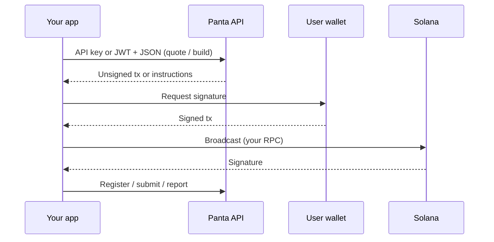

> ## Documentation Index
> Fetch the complete documentation index at: https://docs.panta.market/llms.txt
> Use this file to discover all available pages before exploring further.

# Panta API

> Build Permissionless Prediction Markets Using Our Native API — quote, construct unsigned Solana transactions, and attribute trades without holding user keys.

**Panta** is a binary YES/NO prediction market infrastructure on Solana. This API lets your app browse markets, create markets, buy primary shares, read positions, build win and creator-fee claim transactions, and report trades.

You never custody wallets. Panta returns unsigned transactions (or instruction lists). The user’s wallet signs. You broadcast on **your** RPC, then tell Panta the signature.

<Info>
  Trailing slashes are required. Authenticate with `X-Api-Key` **or** `Authorization: Bearer <access>` ([Authentication](/guides/authentication)).
</Info>

## Base URL

```
https://live-api.panta.market/api/v1
```

API reference pages include an interactive **Try it** playground against this host — see [Authentication](/guides/authentication#try-it-in-these-docs).

## What you can do

<CardGroup cols={2}>
  <Card title="Sign up and mint a key" icon="key" href="/guides/authentication">
    Register or log in, create a `pk_test_…` / `pk_live_…` key, then call product routes.
  </Card>

  <Card title="Browse markets" icon="magnifying-glass" href="/api-reference/markets/catalog">
    List the USDC catalog, fetch detail prices, and read market or wallet trades.
  </Card>

  <Card title="Create a market" icon="plus" href="/api-reference/markets/overview">
    Quote the USDC creation fee, build an unsigned tx, register after broadcast.
  </Card>

  <Card title="Primary buy" icon="chart-line" href="/api-reference/orders/overview">
    Quote a YES/NO fill on the bonding curve, build instructions, submit the signature.
  </Card>

  <Card title="Positions" icon="wallet" href="/api-reference/positions">
    List a wallet’s USDC holdings, phase, and claim eligibility.
  </Card>

  <Card title="Claim winnings" icon="trophy" href="/api-reference/claims/build">
    Build unsigned claim instructions when a resolved market is claimable.
  </Card>

  <Card title="Claim creator fees" icon="coins" href="/api-reference/claims/creator-fees">
    Build unsigned instructions to withdraw graduated-market creator fees.
  </Card>

  <Card title="Trade attribution" icon="receipt" href="/api-reference/trades/report">
    Verify on-chain buys and win claims for volume reporting.
  </Card>
</CardGroup>

## Custody model



Panta cooks the transaction. The user signs. You file it on-chain. Then you send the receipt.

## Amounts

| Surface       | Format                                                                           |
| ------------- | -------------------------------------------------------------------------------- |
| Create market | USDC **base units** as integer strings (6 decimals), e.g. `"50000000"` = 50 USDC |
| Primary buy   | Human-readable **decimal strings**, e.g. `"20.00"`                               |

## Next

<CardGroup cols={2}>
  <Card title="Quickstart" icon="rocket" href="/quickstart">
    Register, mint a key, and make your first request.
  </Card>

  <Card title="How it works" icon="diagram-project" href="/guides/how-it-works">
    Quote → build → sign → broadcast → confirm.
  </Card>

  <Card title="Terms of Use" icon="scale-balanced" href="/guides/terms-of-use">
    Public API Terms — credentials, attribution, and permitted use.
  </Card>
</CardGroup>
